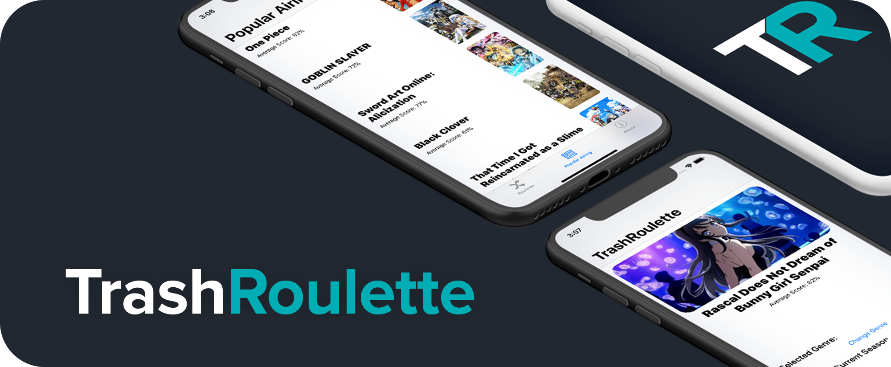
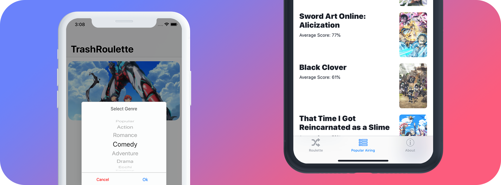

    

My first iOS app written in Swift just to play around with [AniList's API](https://github.com/AniList/ApiV2-GraphQL-Docs). Pretty crap... but it works?

Builds fail because I don't have a dev cert rip.

## Releases

[IPA can be located here.](https://github.com/buitim/TrashRoulette/releases) You will need to sideload yourself (for now) using an app signer (for MacOS) or Cydia Impactor.

Alternatively, you can compile from source.

## Screenshots

## Usage

-   Initial view allows you to pick a genre and get a random show
    -   Able to choose between airing or not airing
-   Top 100 airing shows are shown in another view

## Known Issues

-   App will crash if list of shows returned is nil
-   General Auto-Layout issues because I'm a scrub
-   Some others I've found during testing but was up too late to remember it

## Third-Party Libraries

-   [AniList API](https://github.com/AniList/ApiV2-GraphQL-Docs)
-   [Apollo GraphQL](https://www.apollographql.com/)
-   [Imaginary](https://github.com/hyperoslo/Imaginary)
-   [JGProgressHUD](https://github.com/JonasGessner/JGProgressHUD)
